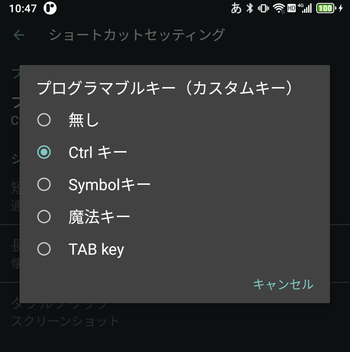

# PocketSKK - SKK for Titan pocket

## 概要

本ソフトウェアは Unihertz Titan pocket 専用のSKK風IME です。

画面をできるだけ占有しない日本語入力IMEを目指しています。


## インストール

[apkファイル](./PocketSKK.apk)をダウンロードしてインストールしてください。

一部の操作でCtrlキーと文字キーの同時押しが必要となるので、Titan pocket の「設定」→「スマートアシスト」→「ショートカットセッティング」→「Fn key」でプログラマブルキー（カスタムキー）を「Ctrl キー」に設定しておきます。




## 凡例

本ドキュメントにおける記法を以下に示します。

| 表記        | 説明                                                         |      |
| ----------- | ------------------------------------------------------------ | ---- |
| `Space`     | キーボード中央下の横棒キー                                   |      |
| `alt+Space` | `alt`キーと`space`キーの同時押し、または`alt`キーを押して離してから`space`キーを押す（altキーのstickey機能） |      |
| `Ctrl+J`    | `fn`キー(Ctrlキーに割り当て)と英字キー`J`の同時押し          |      |
| `Shift`     | キーボード左上の <u>`⇧`</u> キー                             |      |
| `Backspace` | キーボード右側の `⌫` キー                                    |      |
| `Enter`     | キーボード右下の `⏎` キー                                    |      |


## 使用法

- 日本語入力・変換はSKK方式に準じています
  - 一部キー割り当てや機能が本ソフトウェア独自の部分があります

- キートップに印字されている文字は`Shift`キーや `alt`キーと同時に押すことにより入力できます
  - 片手でも入力できるように`Shift`キーと`alt`キーはstickyな動作をします

- キートップに印字されていない文字はソフトウェアキーボードで入力します

  - `sym`キーを押下することによりソフトウェアキーボードの文字が切り替わります
- fnキーをCtrlキーに割り当てることによりCtrlキーと文字キーの同時押しでCtrl+AからCtrl+Zを入力できます
  - `Ctrl+F`にはカーソル右移動を割り当てています
  - `Ctrl+B`にはカーソル左移動を割り当てています
  - その他はOSで処理されます(`Ctrl+A`で全選択等)
- 接頭辞・接尾辞で使用するキーは`?`キーです


基本的なキーの割り当てを以下に示します。 

| キー          | 動作                                           |
| ------------- | ---------------------------------------------- |
| `alt`+`Space` | 日本語入力オンオフ切り替え                     |
| `Ctrl+G`      | 現在の操作をキャンセル                         |
| `Ctrl+B`      | カーソル左移動                                 |
| `Ctrl+F`      | カーソル右移動                                 |
| `Ctrl+Q`      | アスキー文字を全角アルファベットに変換して確定 |
| `Ctrl+J`      | アスキーモード・全英モードからカナモードへ     |
| `Backspace`   | 削除                                           |
| `Enter`       | 改行または確定                                 |
| `q`           | かなモードとカナモードのトグル                 |
| `Q`           | かなモード・カナモードから▽モードへ            |
| `l`           | かなモード・カナモードからアスキーモードへ     |
| `L`           | かなモード・カナモードから全英モードへ         |
| `/`           | かなモード・カナモードからAbbrevモードへ       |
| `?`           | 接頭辞・接尾辞                                 |
| `x`           | 前候補選択                                     |
| `Space`       | 変換開始・次候補選択                           |

`Backspace`と`Enter`キーは入力領域の状態に依って動作が変化します。例えば`Ctrl+A`でテキストを全選択した状態で`Backspace`キーを押下すると選択された部分がすべて削除されます。

変換候補で確定した候補はユーザ辞書の先頭に登録され、次の候補検索の先頭に現れるようになります。

▽モードで見出し語を入力して、スペースキーを押下すると変換候補一覧が表示されます。


標準的なSKKでは接尾語の変換開始に`>` `<` `?` キーが使用できますが、本ソフトウェアでは▼モードの間は候補が表示されるため `<` や `>` を入力することができません。そのため接尾語の変換開始のキーは `?` のみになっています。


## 設定
- 初期入力モード

  - 仮名・英数から選択します

- ローマ字設定

  - 入力時の句点 `,` を「、」「，」から選択します

  - 入力時の読点 `.` を「。」「．」から選択します

  - 入力時のスペースを半角スペース・全角スペースから選択します


## 制限等

- 辞書登録機能は未実装です

- 半角カナ入力モードはありません

- 数値変換機能は未実装です

- 辞書のインポート機能は未実装です

- ユーザ辞書メンテナンス機能は未実装です

  


## 今後の予定

- 辞書のインポート機能

- ユーザ辞書メンテナンス機能

  


## ライセンス等

### PocketSKK
本ソフトウェアには Apache ライセンスが適用されます。

>    Copyright 2021 kachaya
>
>    Licensed under the Apache License, Version 2.0 (the "License");
>    you may not use this file except in compliance with the License.
>    You may obtain a copy of the License at
>
>        http://www.apache.org/licenses/LICENSE-2.0
>
>    Unless required by applicable law or agreed to in writing, software
>    distributed under the License is distributed on an "AS IS" BASIS,
>    WITHOUT WARRANTIES OR CONDITIONS OF ANY KIND, either express or implied.
>    See the License for the specific language governing permissions and
>    limitations under the License.


### MapDB
本ソフトウェアはデータベースエンジンとして [MapDB](https://github.com/jankotek/MapDB/tree/release-1.0) Version 1.0.9 を使用しています。

```
MapDB
Copyright 2012-2014 Jan Kotek

This product includes software developed by Thomas Mueller and H2 group
Relicensed under Apache License 2 with Thomas permission.
(CompressLZF.java and EncryptionXTEA.java)
Copyright (c) 2004-2011 H2 Group

This product includes software developed by Doug Lea and JSR 166 group:
(LongConcurrentMap.java, Atomic.java)

 * Written by Doug Lea with assistance from members of JCP JSR-166
 * Expert Group and released to the public domain, as explained at
 * http://creativecommons.org/licenses/publicdomain


This product includes software developed for Apache Solr
(LongConcurrentLRUMap.java)
Copyright 2006-2014 The Apache Software Foundation

This product includes software developed for Apache Harmony
(LongHashMap.java)
Copyright 2008-2012 The Apache Software Foundation


This product includes software developed by Nathen Sweet for Kryo
Relicensed under Apache License 2 (or later) with Nathans permission.
(DataInput2.packInt/Long and DataOutput.unpackInt/Long methods)
Copyright (c) 2012 Nathan Sweet

This product includes software developed for Android project
(SerializerPojo, a few lines to invoke constructor, see comments)
//Copyright (C) 2012 The Android Open Source Project, licenced under Apache 2 license

This product includes software developed by Heinz Kabutz for javaspecialists.eu
(SerializerPojo, a few lines to invoke constructor, see comments)
2010-2014 Heinz Kabutz

Some Map unit tests are from  Google Collections.
Credit goes to Jared Levy, George van den Driessche and other Google Collections developers.
Copyright (C) 2007 Google Inc.

Luc Peuvrier wrote some unit tests for ConcurrerentNavigableMap interface.
```


### SKK辞書
本ソフトウェアではSKK-JISYO.LをMapDB形式のファイルに変換したものを同梱しています。

```
;; Large size dictionary for SKK system
;; Copyright (C) 1988-1995, 1997, 1999-2014
;;
;; Masahiko Sato <masahiko@kuis.kyoto-u.ac.jp>
;; Hironobu Takahashi <takahasi@tiny.or.jp>,
;; Masahiro Doteguchi, Miki Inooka,
;; Yukiyoshi Kameyama <kameyama@kuis.kyoto-u.ac.jp>,
;; Akihiko Sasaki, Dai Ando, Junichi Okukawa,
;; Katsushi Sato and Nobuhiro Yamagishi
;; NAKAJIMA Mikio <minakaji@osaka.email.ne.jp>
;; MITA Yuusuke <clefs@mail.goo.ne.jp>
;; SKK Development Team <skk@ring.gr.jp>
;;
;; Maintainer: SKK Development Team <skk@ring.gr.jp>
;; Keywords: japanese
;;
;; This dictionary is free software; you can redistribute it and/or
;; modify it under the terms of the GNU General Public License as
;; published by the Free Software Foundation; either version 2, or
;; (at your option) any later version.
;;
;; This dictionary is distributed in the hope that it will be useful,
;; but WITHOUT ANY WARRANTY; without even the implied warranty of
;; MERCHANTABILITY or FITNESS FOR A PARTICULAR PURPOSE.  See the GNU
;; General Public License for more details.
;;
;; You should have received a copy of the GNU General Public License
;; along with Daredevil SKK, see the file COPYING.  If not, write to
;; the Free Software Foundation Inc., 59 Temple Place - Suite 330,
;; Boston, MA 02111-1307, USA.
```


辞書ファイルを変換するのに使用したコードを以下に示します。

```java
import java.io.BufferedReader;
import java.io.BufferedWriter;
import java.io.File;
import java.io.FileInputStream;
import java.io.FileWriter;
import java.io.InputStreamReader;

import org.mapdb.DB;
import org.mapdb.DBMaker;
import org.mapdb.HTreeMap;

public class DicMaker {
	static final String SKK_JISYO_SOURCE = "SKK-JISYO.L";
	static final String SKK_JISYO_CHARSET = "EUC-JP";
	static final String SKK_JISYO_TEXT = "entry.txt";
	static final String MAP_NAME = "dic";
	static final String DB_NAME = "main_dic.db";
	static public void main(String[] argv) {
		try {
			DB db = DBMaker.newFileDB(new File(DB_NAME)).closeOnJvmShutdown().transactionDisable().make();
			HTreeMap<String, String> map = db.getHashMap(MAP_NAME);
			BufferedReader br = new BufferedReader(new InputStreamReader(new FileInputStream(SKK_JISYO_SOURCE), SKK_JISYO_CHARSET));
			BufferedWriter bw = new BufferedWriter(new FileWriter(new File(SKK_JISYO_TEXT)));
			for (String line = br.readLine(); line != null; line = br.readLine()) {
				if (line.startsWith(";;")) {
					continue;
				}
				int idx = line.indexOf(' ');
				if (idx == -1) {
					continue;
				}
				String key = line.substring(0, idx);
				String value = line.substring(idx + 1);
				if (key.contains("う゛")) {
					key = key.replace("う゛", "\u3094"); // "ゔ"
				}
				String data[] = value.split("/");
				StringBuilder sb = new StringBuilder();
				for (int i = 0; i < data.length; i++) {
					if (data[i].length() == 0) {
						continue;
					}
					int aidx = data[i].indexOf(';');
					if (aidx != -1) {
						data[i] = data[i].substring(0, aidx);
					}
					if (data[i].contains("(concat ")) {
						String parts[] = data[i].split("\"");
						data[i] = parts[1].replace("\\057", "/");
					}
					if (sb.length() != 0) {
						sb.append("\t");
					}
					sb.append(data[i]);
				}
				value = sb.toString();
				map.put(key, value);
				bw.write(key + "\t" + value + "\n");
			}
			bw.close();
			db.commit();
			db.close();
			br.close();
		} catch (Exception e) {
			throw new RuntimeException(e);
		}
	}
}

```

